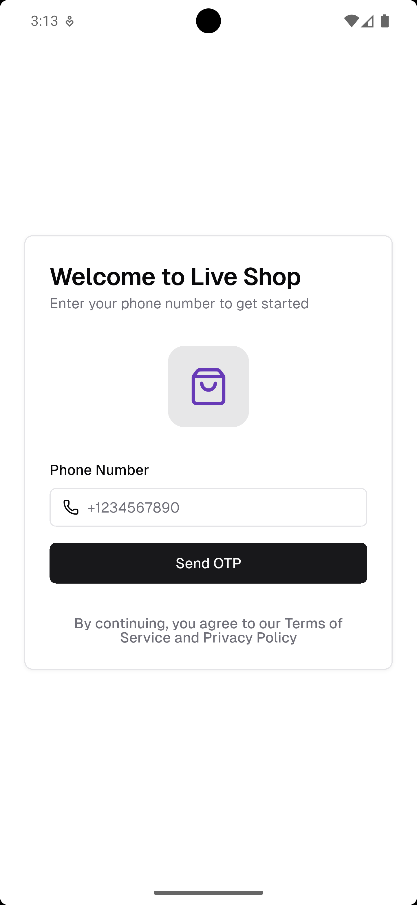
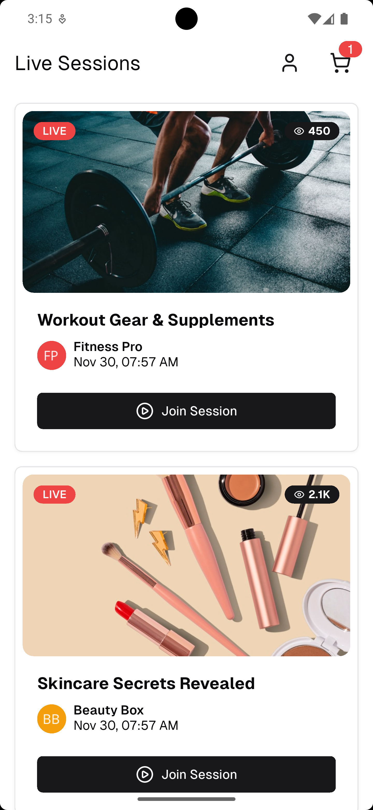
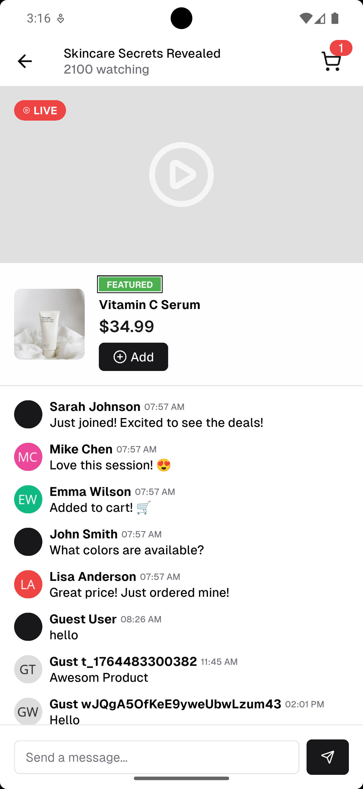
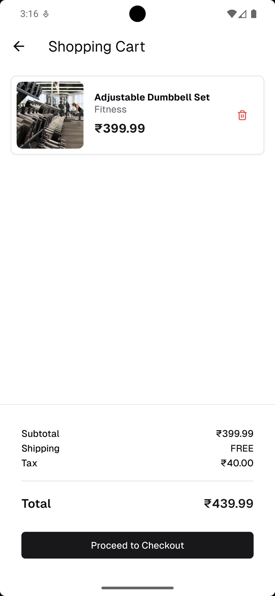
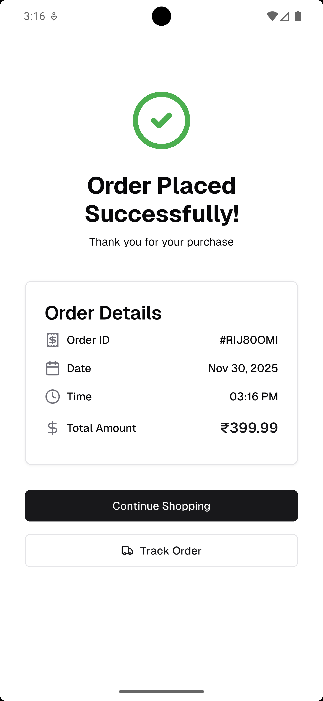
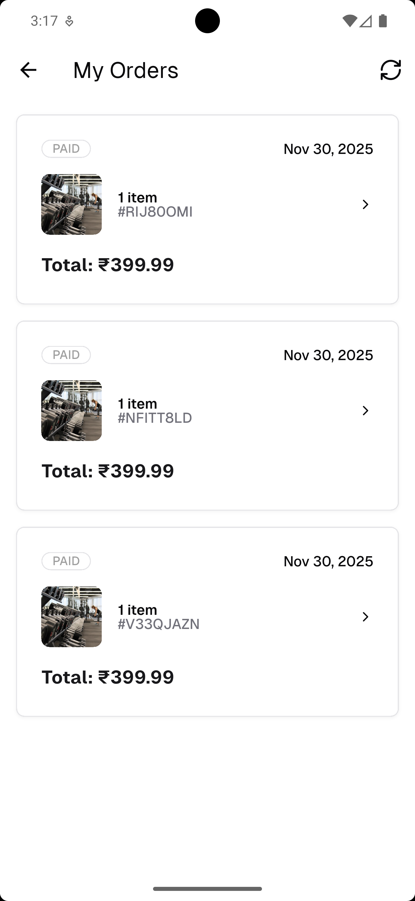

# 📱 Live Shop – Real-Time Co-Shopping & Live Commerce App

A modern Flutter application enabling **real-time live shopping**, **interactive chat**, **product
highlights**, **cart system**, and **mock checkout flow** — built with **Clean Architecture**, *
*BLoC**, and **Firebase** (or mock services).

---

## 🚀 Overview

Live Shop is a Flutter app designed for real-time live commerce use cases where:

- Seller/Creator goes live
- Users join the live session
- Viewers send chat messages in real time
- Seller highlights products
- Viewers add products to cart
- Users place mock orders

This repository contains a **complete, scalable, production-ready Flutter architecture**, following
best practices.

---

# 🏗 Project Architecture

This project follows **Clean Architecture** using:

- **Presentation Layer** → UI + BLoC
- **Domain Layer** → Entities + Repositories
- **Data Layer** → Models + DataSources + Repository Implementations

```

lib/
│ bootstrap.dart
│ firebase_options.dart
│ firebase_seed_script.dart
│ main_development.dart
│ main_production.dart
│ main_staging.dart
│
├── app/
│   └── app.dart
│
├── core/
│   ├── constants/
│   ├── di/
│   ├── errors/
│   └── utils/
│
├── data/
│   ├── datasources/
│   ├── models/
│   └── repositories/
│
├── domain/
│   └── repositories/
│
├── l10n/
│
└── presentation/
├── blocs/
├── pages/
└── widgets/

```

---

# 📦 Features Implemented

### ✅ 1. Login Screen

- Mobile number login
- Mock OTP verification
- Validation with error UI
- Navigate to Live Sessions

### ✅ 2. Live Sessions List

Displays:

- Creator name
- Session title
- Join button

### ✅ 3. Live Session Room

#### A. Real-time Chat

- Chat list + input
- Auto-scroll
- Mock or Firebase real-time updates

#### B. Product Highlight Panel

- Product image
- Name
- Price
- Add to Cart button

### ✅ 4. Cart & Checkout

- List of added products
- Quantity + total price
- Place mock order
- Order success screen

---

# 📁 Folder Structure Explained

## 🔹 core/

Shared app utilities:

- `constants/` → sizes, constant values
- `di/` → GetIt dependency injection
- `errors/` → Failure classes
- `utils/` → validators, helpers

## 🔹 data/

Handles real/mock data:

- `datasources/local` → SharedPrefs
- `datasources/remote` → Firebase/Mock API
- `models` → JSON serializable models
- `repositories` → implementation layer

## 🔹 domain/

Business logic:

- abstract repository interfaces

## 🔹 presentation/

UI + BLoC:

- blocs → feature logic
- pages → UI screens
- widgets → reusable UI components

---

# 🧩 State Management

Uses **BLoC / Cubit** for predictable and scalable state control.

### Sample blocs:

```

AuthBloc
SessionBloc
CartCubit
ChatCubit
OrdersCubit

```

Each includes:

```

feature_bloc.dart
feature_event.dart
feature_state.dart

```

---

# 🧪 Mock Data (JSON)

Place inside:

```

assets/mock_data/

````

### sessions.json

```json
[
  {
    "id": "s1",
    "title": "Fashion Live Sale",
    "creator": "Aarav Mehta",
    "product": {
      "id": "p1",
      "name": "Blue Denim Jacket",
      "price": 1299,
      "image": "https://example.com/denim.jpg"
    }
  }
]
````

### messages.json

```json
[
  {
    "id": "m1",
    "sender": "User1",
    "message": "Hello!",
    "timestamp": 1710000
  }
]
```

---

# ▶️ How to Run the Project

### 1. Install Flutter

[https://docs.flutter.dev/get-started/install](https://docs.flutter.dev/get-started/install)

### 2. Install dependencies

```
flutter pub get
```

### 3. Generate JSON model code

```
flutter pub run build_runner build --delete-conflicting-outputs
```

### 4. Run the app

Development:

```
flutter run -t lib/main_development.dart
```

Staging:

```
flutter run -t lib/main_staging.dart
```

Production:

```
flutter run -t lib/main_production.dart
```

---

# 🛠 Tech Stack

| Category      | Tools               |
|---------------|---------------------|
| Language      | Dart                |
| Framework     | Flutter             |
| State Mgmt    | BLoC + Cubit        |
| Architecture  | Clean Architecture  |
| DI            | GetIt               |
| API / DB      | Firebase            |
| Serialization | json_serializable   |
| UI Kit        | shadcn_ui           |
| Local Storage | Shared Preferences  |


---

# 🎯 App Flow

```
Login 
  ↓
Live Sessions
  ↓
Join Live Session
  ↓
Live Room
   ↳ Real-time Chat
   ↳ Product Highlight
   ↳ Add to Cart
  ↓
Cart
  ↓
Checkout
  ↓
Order Success
```

---

# 🖼 Screenshots (Placeholder Paths)

```
assets/screenshots/login.png
assets/screenshots/sessions.png
assets/screenshots/room.png
assets/screenshots/cart.png
assets/screenshots/success.png
assets/screenshots/orders.png
```


# 🖼 Screenshots

### 🔹 Login Screen


### 🔹 Sessions List


### 🔹 Live Room


### 🔹 Cart


### 🔹 Order Success


### 🔹 Orders Page



---

# 📦 Building APK

### Debug:

```
flutter build apk
```

### Release:

```
flutter build apk --release
```

APK output:

```
build/app/outputs/flutter-apk/app-release.apk
```

---

# 🔐 Environments Supported

Entry points:

```
main_development.dart
main_staging.dart
main_production.dart
```

Common configuration:

```
bootstrap.dart
firebase_options.dart
```

---

# 🚀 Optional Improvements

* Agora/WebRTC live video
* Push notifications
* Payment gateway (UPI, cards)
* Dark mode
* Recommendations engine
* Analytics dashboard

---

# ❤️ Author

**Vikas Poute**
Flutter Developer (2+ Years)
Expert in Flutter • Java • Spring Boot • AWS • Clean Architecture

---
